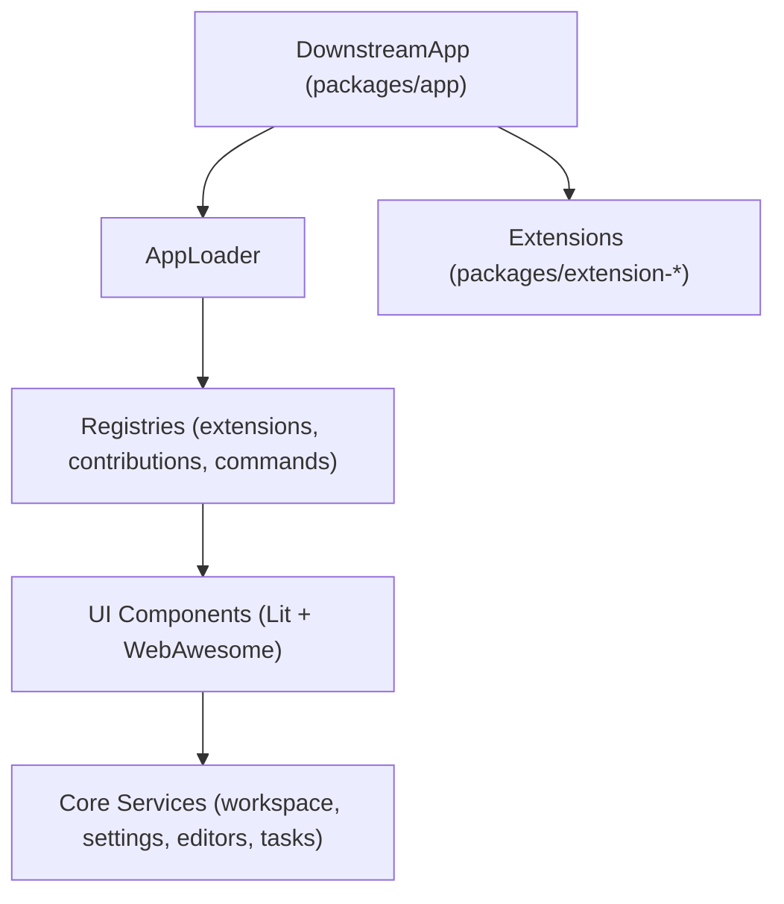

<p align="center">
  
</p>

<p align="center">
  <a href="https://deepwiki.com/eclipse-docks/core"></a>
  <a href="https://github.com/eclipse-docks/core/actions/workflows/ci.yml"></a>
  <a href="https://codecov.io/gh/eclipse-docks/core"></a>
  <a href="https://www.npmjs.com/package/@eclipse-docks/core"></a>
  <a href="https://github.com/eclipse-docks/core/blob/main/LICENSE"></a>
</p>

# Eclipse Docks

Eclipse Docks is a runtime web platform for building modular, extensible desktop- and dashboard-style web applications, running fully in the browser and integrating with any existing backend.

**Demo app:** [https://docks.eclipse.dev](https://docks.eclipse.dev)

**Docs:** [https://docks.eclipse.dev/docs/](https://docks.eclipse.dev/docs/)

**DeepWiki (interactive docs):** [talk to the code and architecture](https://deepwiki.com/eclipse-docks/core) — the recommended way to explore internals and ask questions about the codebase.

## How to get started

### Create a new Docks app (recommended)

Use the official scaffolder to create a new Eclipse Docks app (monorepo with app + example extension):

```bash
npm create @eclipse-docks/app my-app
cd my-app
npm run dev
```

This gives you a project with:

- `packages/app` — your Docks app (configure logo, layout, and extensions).
- `packages/example-extension` — a sample extension that adds a view to the left sidebar.

Common places to start customizing:

- Update app metadata, logo, and the extensions list in the app entry file under `packages/app/src/`.
- Use `packages/example-extension` as a template for your own domain-specific extensions.

### Explore and learn the internals

- Use **DeepWiki** at [https://deepwiki.com/eclipse-docks/core](https://deepwiki.com/eclipse-docks/core) to ask questions about architecture, services, and extension points directly against the codebase.
- Browse the docs at [https://docks.eclipse.dev/docs/](https://docks.eclipse.dev/docs/) for conceptual overviews and examples.

### Advanced: work on this repo

If you want to work on the Docks core itself or run the default example app from this repository:

```bash
git clone https://github.com/eclipse-docks/core.git
cd core
npm install
npm run dev
```

This builds core, then starts the default app (Vite dev server). Open the URL shown in the terminal (e.g. `http://localhost:5173`).

To build for production:

```bash
npm run build        # build core only
npm run build:app    # build the default app (depends on core)
```

---

## Architecture (for app authors)

At a high level, a downstream Docks app wires together an app definition, extensions, and the core services and UI components.


```mermaid
flowchart TD
  app["DownstreamApp (packages/app)"] --> appLoader["AppLoader"]
  app --> extensions["Extensions (packages/extension-*)"]
  appLoader --> registries["Registries (extensions, contributions, commands)"]
  registries --> ui["UI Components (Lit + WebAwesome)"]
  ui --> coreServices["Core Services (workspace, settings, editors, tasks)"]
```

- **App** — defines which extensions are enabled, which layout to use, and high-level contributions (tabs, toolbars, views).
- **Extensions** — feature bundles that register views, commands, and services for your domain.
- **Registries** — keep track of extensions, UI contributions, and commands so they can be enabled, disabled, or remapped per app.
- **UI components** — Lit-based `docks-*` components plus WebAwesome UI primitives.
- **Core services** — workspace, settings, editors, tasks, events, and dependency injection.

For a deeper, more detailed tour of the architecture (including concepts like contribution remapping), use **DeepWiki** on the `eclipse-docks/core` project or see the docs under `docs/concepts/`.

### Monorepo layout

| Path | Role |
|------|------|
| **`packages/core`** (`@eclipse-docks/core`) | Platform: registries, services, parts, widgets, dialogs, default UI contributions. No extension logic; extensions are separate packages. |
| **`packages/extension-*`** | One package per extension (e.g. `extension-ai-system`, `extension-settings-tree`, `extension-monaco-editor`). Each depends on core and registers commands/contributions/editors. |
| **`packages/app`** | Default app: imports core + extensions, defines `AppDefinition` and `extensions[]`, registers with app loader. Use as template for your own app. |
| **`packages/app-e2e`** | Playwright harness only: minimal Vite app + specs under `packages/app-e2e/e2e/`. Not the product demo. Run `npm run test:e2e` from the repo root. |
| **Root** | Workspace root. Scripts: `dev`, `build`, `build:app`, `test`, `test:e2e`. |

### Testing

- **Unit:** `npm run test` — Vitest in `@eclipse-docks/core`.
- **E2E:** `npm run test:e2e` — Playwright against the minimal shell in `packages/app-e2e` (headless by default; CI runs the same command). See [packages/app-e2e/README.md](packages/app-e2e/README.md) for how the harness is wired and why (e.g. extension load order for auxiliary tabs).

### Main concepts

- **Apps** — One or more apps register via `AppDefinition`: `name`, `version`, `extensions[]`, optional `layout` (id string or `{ id, props }` to parameterize), `contributions`, `initialize` / `dispose`. The app root is always the chosen layout's component.
- **Layouts** — Registered via `LayoutContribution` (slot `system.layouts`): `id`, `name`, `component` (Lit template), optional `onShow`. Core registers the standard (IDE) layout; apps can register additional layouts (e.g. dashboard). Users switch layout via the toolbar layout switcher.
- **Extensions** — Register with `extensionRegistry`; provide a loader that runs when the extension is enabled. Register commands, contributions, editors, services.
- **Contributions** — Declarative UI: tabs (sidebars, editor area), toolbar buttons, HTML blocks. Targets include `SIDEBAR_MAIN`, `SIDEBAR_AUXILIARY`, `TOOLBAR_MAIN_RIGHT`, `TOOLBAR_BOTTOM_END`, etc.
- **Commands** — Id + handlers (with optional `canExecute`). Toolbar/menus reference commands; AI and command palette can execute them.
- **Contribution remapping (per app)** — Apps can opt into a mapping layer (via `AppDefinition.remaps`) that **decouples where a contribution is defined from where it is rendered**. This allows downstream apps to move or hide platform and extension UI (e.g. moving the AI view from the right sidebar to the left, or disabling it entirely) without forking core or the extension. See the docs under `docs/concepts/contributions.md` for detailed usage.

Extensions are **in-process and trust-based** (similar to Eclipse RCP–style desktop plugins). For browser deployments and trust boundaries, see [Security and safety](docs/concepts/security.md).

---

## Technology stack

Eclipse Docks is built on a lightweight, browser-native stack:

- **Lit** — Web components for core and extensions ([Lit docs](https://lit.dev/)).
- **WebAwesome** — UI primitives and theming.
- **TypeScript** — Typed public APIs.
- **Vite** — Build and dev server.

Optional extensions add capabilities like the Monaco editor, Pyodide, WebLLM, WebMCP, RxDB, and Xenova transformers.

### Asset size (reference)

Exact sizes move with each **`@eclipse-docks/core`**, extension, and Vite release; treat the table as **order-of-magnitude** guidance.

| Scenario | **`packages/app/dist`** (typical) | **File count** (typical) |
| -------- | ----------------------------------- | ------------------------ |
| **Minimal (core-only)** | ~950 KB on disk | ~18 |
| **Default create-app template** | ~6 MB on disk | ~170 |

**Minimal** — Vite app with only `@eclipse-docks/core`, **`extensions: []`**, no PWA or other extensions. Main JS ~810 KB minified (~196 KB gzip); main CSS ~99 KB minified (~14 KB gzip).

**Default create-app** — `npm create @eclipse-docks/app` as shipped: default extensions, PWA, `extension-example`. Largest pieces: Monaco / editor worker bundles (multi‑MB JS), many language and extension chunks; PWA **`sw.js`** precaches the build (**~6 MB** precache in a recent measure).

---

## Eclipse Docks vs Eclipse Theia

Both are **Eclipse Foundation** technology projects, but they target different architectures: **Theia** is a **VS Code–oriented** platform with a **Node** backend; **Docks** is a **browser-first** shell you connect to **your** APIs.

| | **Eclipse Docks** | **Eclipse Theia** |
| --- | --- | --- |
| **Runtime** | **Browser SPA** — UI and extensions in the client. | **Frontend + Node backend** ([architecture](https://theia-ide.org/docs/architecture/)). |
| **Hosting & scale** | **Static assets** (e.g. CDN); no Docks server tier for the shell. | **Scale the Node** tier for cloud / multi-user IDE setups. |
| **Extensions** | **npm** packages + registries; **planned:** [Open VSX](https://open-vsx.org/) **browser** extensions, **subset** `vscode` API. | **Theia + VS Code** extensions; **Open VSX** first-class ([extensions](https://theia-ide.org/docs/extensions/)). |
| **Product fit** | **Composable** IDE-like / dashboard apps with a **small** core. | **Full IDE** products (desktop **Electron**, remote, VS Code–class). |
| **PWA / offline** | **PWA-ready** — add manifest + service worker; **offline** for the client shell and caches can be implemented. | Desktop **Electron** is common; web deployments usually assume a **reachable backend**. |

**Rule of thumb:** need **VS Code–class** backend + extension host → **Theia**. Need a **lightweight web shell** and **your** backends → **Docks**.

For **browser standards**, PWA, and **long-term** positioning (vs VS Code–aligned stacks), see the **Standards & longevity** section in the full comparison.

**Full comparison:** [Eclipse Docks vs Eclipse Theia](https://docks.eclipse.dev/docs/concepts/docks-vs-theia) (or [`docs/concepts/docks-vs-theia.md`](docs/concepts/docks-vs-theia.md) in this repo).

---

## Comparison with other frameworks

For those comparing frameworks, here is how Eclipse Docks lines up with Angular, React, and Vue on common dimensions.

| Dimension | **Eclipse Docks** | **Angular** | **React** | **Vue** |
| --------- | ------------ | ----------- | --------- | ------- |
| **Paradigm** | App framework for IDE-like and dashboard-like apps; declarative contributions (tabs, toolbars, commands) | Full framework; components + services + modules | Library; components + hooks | Progressive framework; SFCs + composition API |
| **Component tech** | Lit web components (`docks-*` custom elements) | Angular components (decorators/templates) | JSX/TSX components | Single-File Components (`.vue`) or JSX |
| **Templating** | Lit `html` tagged templates | HTML-like templates + directives | JSX | HTML-like template or JSX |
| **TypeScript** | First-class; strict, declarations published | First-class; full TS support | Supported (TS + React types) | First-class; full TS in SFC and script |
| **State management** | `@lit-labs/signals` in core; `watchSignal()`; signals for app state (active part, editor, selection, tasks) | RxJS + services; optional NgRx/Akita | useState/useReducer; ecosystem (Redux, Zustand, Jotai) | reactivity (ref, reactive); Pinia optional |
| **Routing / Navigation** | No URL router; contribution targets and slots (IDE: sidebars/editor/panel; dashboard: custom shell + views) | Angular Router (URL-based, lazy loading) | React Router (community); URL-based | Vue Router (official); URL-based |
| **Forms** | No built-in form framework; ad-hoc with WebAwesome/Lit | Reactive Forms / Template-driven forms | Uncontrolled/controlled components; Formik, React Hook Form | v-model + validation; VeeValidate, etc. |
| **HTTP / Data** | No built-in HTTP client; fetch or extensions (e.g. GitHub, ESM.sh) | HttpClient; interceptors | fetch / axios; TanStack Query common | fetch / axios; TanStack Query common |
| **i18n** | Built-in: `i18n()` (typed namespace, co-located JSON), `currentLanguageSignal`, locales discovered from bundles | @angular/localize; build-time or runtime | react-i18next, react-intl | vue-i18n (official) |
| **Testing** | Vitest (unit tests in core); Playwright E2E harness (`packages/app-e2e`) | Jasmine/Karma or Jest; Angular Testing Library | Jest + React Testing Library; Vitest | Jest/Vitest + Vue Test Utils |
| **Build / Bundling** | Vite 7; core as library (ES, multiple entries); app as Vite SPA | Angular CLI (esbuild/webpack) | Vite, Create React App, Next.js, etc. | Vite (default), Vue CLI, Nuxt |
| **Runtime footprint** | **Browser-native** tech stack (Lit, standard DOM, Web APIs); **very lightweight** runtime; no heavy framework runtime layer | Full framework runtime; larger baseline | Small library; ecosystem can add weight | Small core; ecosystem can add weight |
| **CLI** | `npm create @eclipse-docks/app` (scaffold new app); npm scripts: dev, build, build:app, test | Angular CLI (generate, build, serve) | Create React App, Vite templates | Vue CLI, create-vue; Nuxt CLI |
| **SSR** | Client-only; no app-level SSR | Angular Universal | Next.js, Remix, etc. | Nuxt, Vite SSR |
| **Styling / Theming** | WebAwesome themes (theme classes, palettes); CSS in components | Encapsulated CSS; Angular Material theming | CSS Modules, styled-components, Tailwind | Scoped CSS; Vuetify/Quasar theming |
| **Dependency injection** | Built-in: `rootContext`, `uiContext`; services (appLoader, commandRegistry, workspace, settings, etc.) | Built-in hierarchical injector | Context API or external (Inversify, etc.) | provide/inject (composition API) |
| **Plugin / Extension model** | Core feature: extensions (per-app), contribution + command registries; loaders; enable/disable at runtime; **marketplace**: install external extensions from catalog URLs (e.g. appspace-marketplace) | NgModules; lazy-loaded feature modules | No standard; plugin patterns ad-hoc | Plugins (use()); Nuxt modules |
| **Commands / shortcuts** | Built-in: command registry, keybindings, command palette | No built-in; custom or libs | No built-in; custom or libs | No built-in; custom or libs |
| **Layouts / App modes** | Layout contributions (slot `system.layouts`); default `standard` (IDE); optional layouts (e.g. dashboard); layout switcher in toolbar | App shell + router-outlet | App shell + router; layout is component tree | App shell + router; layout is component tree |
| **Primary use case** | IDE-like apps and dashboard-like apps (tabs, workspace, editors, views, AI, extensions) | Enterprise SPAs, large teams | SPAs, dashboards, content apps | SPAs, progressive enhancement |
| **License** | EPL-2.0 | MIT | MIT | MIT |

## Repository and license

- **Repository:** [github.com/eclipse-docks/core](https://github.com/eclipse-docks/core)
- **License:** EPL-2.0 (see [LICENSE](LICENSE) and [NOTICE](NOTICE))
- **Contributing:** See [CONTRIBUTING.md](CONTRIBUTING.md)

Publishing of `@eclipse-docks/core` and extensions is done via GitHub Actions on version tags; see workflow and npm trusted publishing in the repo.
