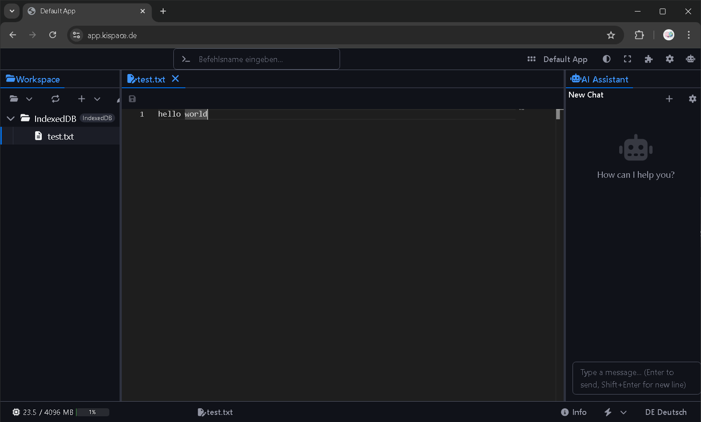
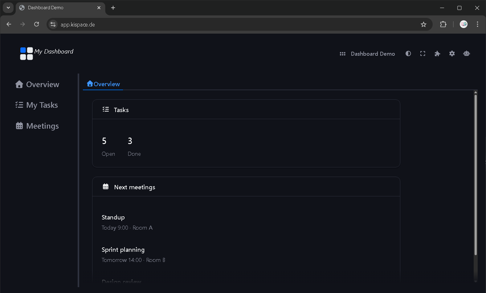
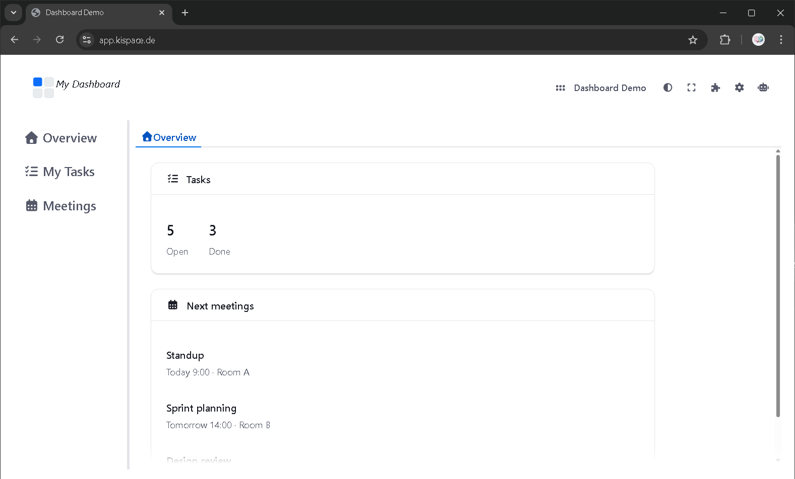
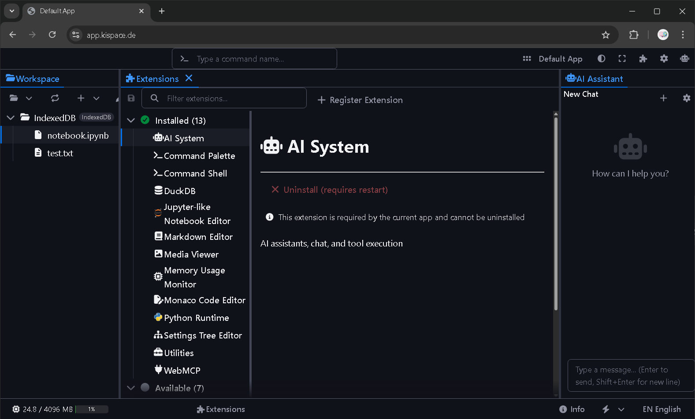
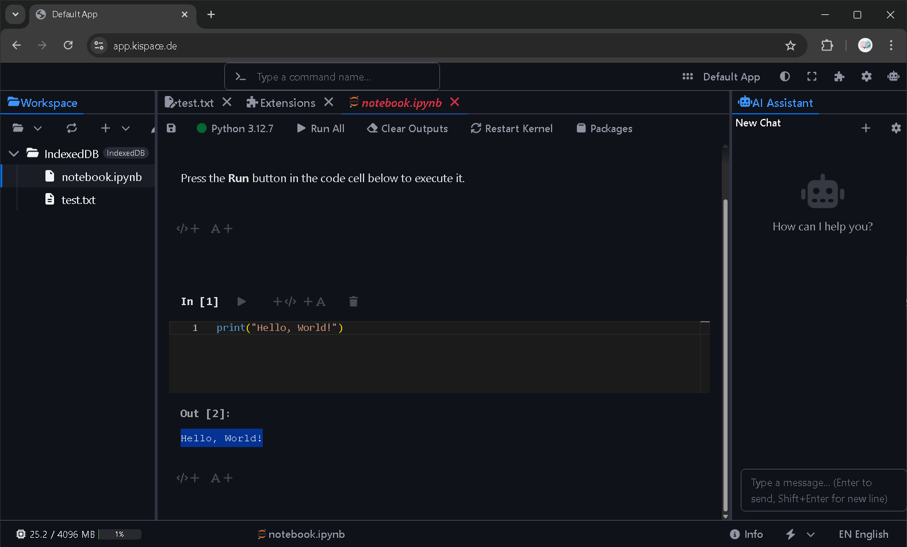

<p align="center">
  
</p>

<p align="center">
  <a href="https://deepwiki.com/eclipse-lyra/core"></a>
  <a href="https://github.com/eclipse-lyra/core/actions/workflows/ci.yml"></a>
  <a href="https://www.npmjs.com/package/@eclipse-lyra/core"></a>
  <a href="https://github.com/eclipse-lyra/core/blob/main/LICENSE"></a>
</p>

# Eclipse Lyra

Eclipse Lyra provides a TypeScript- and Lit-based web framework for building extensible developer tools and applications. It includes an extension system with lifecycle management, a declarative way to add UI elements (such as tabs, toolbars, and commands), a context-aware command system usable by both users and AI agents, workspace and file-system abstractions, and services for editors and tasks, with optional components such as AI chat, notebooks, a terminal, and the Monaco editor.

**Demo app:** [https://app.kispace.de](https://app.kispace.de)

**Docs:** [https://app.kispace.de/docs/](https://app.kispace.de/docs/)

**DeepWiki Docs**: [talk to the code](https://deepwiki.com/eclipse-lyra/core)

---
## Used by

Downstream domain-specific apps:

**geo!space** — geospatial workflows (WebGIS): [https://geo.kispace.de](https://geo.kispace.de)

**neuro!space** — neuroimaging workflows: [https://neuro.kispace.de](https://neuro.kispace.de)

---

## Screenshots

**IDE layout (dark)**  


**Dashboard (dark)**  


**Dashboard (light)**  


**Extensions**  


**Notebook with Python**  


---

## Architecture

### Layers

```
┌─────────────────────────────────────────────────────────────┐
│  Applications (packages/app, or custom apps)                 │
│  – AppDefinition: extensions, optional layout (id or { id, props }) │
│  – Layouts registered via LayoutContribution (system.layouts)│
└─────────────────────────────────────────────────────────────┘
                              │
                              ▼
┌─────────────────────────────────────────────────────────────┐
│  App Loader (core)                                          │
│  – App registration & lifecycle  – Extension enable/disable │
│  – Layout resolution & preferred layout  – Render layout root│
└─────────────────────────────────────────────────────────────┘
                              │
        ┌─────────────────────┼─────────────────────┐
        ▼                     ▼                     ▼
┌───────────────┐   ┌─────────────────┐   ┌───────────────┐
│  Extensions   │   │  Contributions   │   │   Commands    │
│  Registry     │   │  Registry       │   │   Registry    │
│  (per-app)    │   │  (tabs, toolbars)│   │   (handlers)  │
└───────────────┘   └─────────────────┘   └───────────────┘
        │                     │                     │
        └─────────────────────┼─────────────────────┘
                              ▼
┌─────────────────────────────────────────────────────────────┐
│  UI (core)                                                   │
│  lyra-standard-layout · lyra-tabs · lyra-toolbar · lyra-filebrowser · …    │
└─────────────────────────────────────────────────────────────┘
                              │
                              ▼
┌─────────────────────────────────────────────────────────────┐
│  Core services                                               │
│  Workspace · Settings · Editor registry · Tasks · Events · DI│
└─────────────────────────────────────────────────────────────┘
```

### Monorepo layout

| Path | Role |
|------|------|
| **`packages/core`** (`@eclipse-lyra/core`) | Platform: registries, services, parts, widgets, dialogs, default UI contributions. No extension logic; extensions are separate packages. |
| **`packages/extension-*`** | One package per extension (e.g. `extension-ai-system`, `extension-settings-tree`, `extension-monaco-editor`). Each depends on core and registers commands/contributions/editors. |
| **`packages/app`** | Default app: imports core + extensions, defines `AppDefinition` and `extensions[]`, registers with app loader. Use as template for your own app. |
| **Root** | Workspace root. Scripts: `dev`, `build`, `build:app`, `test`. |

### Main concepts

- **Apps** — One or more apps register via `AppDefinition`: `name`, `version`, `extensions[]`, optional `layout` (id string or `{ id, props }` to parameterize), `contributions`, `initialize` / `dispose`. The app root is always the chosen layout's component.
- **Layouts** — Registered via `LayoutContribution` (slot `system.layouts`): `id`, `name`, `component` (Lit template), optional `onShow`. Core registers the standard (IDE) layout; apps can register additional layouts (e.g. dashboard). Users switch layout via the toolbar layout switcher.
- **Extensions** — Register with `extensionRegistry`; provide a loader that runs when the extension is enabled. Register commands, contributions, editors, services.
- **Contributions** — Declarative UI: tabs (sidebars, editor area), toolbar buttons, HTML blocks. Targets include `SIDEBAR_MAIN`, `SIDEBAR_AUXILIARY`, `TOOLBAR_MAIN_RIGHT`, `TOOLBAR_BOTTOM_END`, etc.
- **Commands** — Id + handlers (with optional `canExecute`). Toolbar/menus reference commands; AI and command palette can execute them.

---

## How to get started

### Prerequisites

- Node.js 18+
- npm or pnpm

### Run the default app

```bash
git clone https://github.com/eclipse-lyra/core.git
cd core
npm install
npm run dev
```

This builds core, then starts the default app (Vite dev server). Open the URL shown in the terminal (e.g. `http://localhost:5173`).

### Build for production

```bash
npm run build        # build core only
npm run build:app    # build the default app (depends on core)
```

### Create your own app

Use the official scaffolder to create a new Eclipse Lyra app (monorepo with app + example extension):

```bash
npm create @eclipse-lyra/app my-app
cd my-app
npm run dev
```

This creates a project with **`packages/app`** (the Lyra app) and **`packages/example-extension`** (a sample extension that adds a view to the left sidebar). Customize the app in `packages/app/src/main.ts` (extensions list, logo) and use the example extension as a reference for adding your own extensions.

---

## Technology stack

- **Lit** — Web components (core and extensions)
- **TypeScript** — Typed API
- **WebAwesome** — UI primitives
- **Vite** — Build and dev server

Other extensions add: Monaco editor, Pyodide, WebLLM, WebMCP, RxDB, Xenova transformers, etc.

---

## Comparison with other frameworks

For those comparing frameworks, here is how Eclipse Lyra lines up with Angular, React, and Vue on common dimensions.

| Dimension | **Eclipse Lyra** | **Angular** | **React** | **Vue** |
| --------- | ------------ | ----------- | --------- | ------- |
| **Paradigm** | App framework for IDE-like and dashboard-like apps; declarative contributions (tabs, toolbars, commands) | Full framework; components + services + modules | Library; components + hooks | Progressive framework; SFCs + composition API |
| **Component tech** | Lit web components (`lyra-*` custom elements) | Angular components (decorators/templates) | JSX/TSX components | Single-File Components (`.vue`) or JSX |
| **Templating** | Lit `html` tagged templates | HTML-like templates + directives | JSX | HTML-like template or JSX |
| **TypeScript** | First-class; strict, declarations published | First-class; full TS support | Supported (TS + React types) | First-class; full TS in SFC and script |
| **State management** | `@lit-labs/signals` in core; `watchSignal()`; signals for app state (active part, editor, selection, tasks) | RxJS + services; optional NgRx/Akita | useState/useReducer; ecosystem (Redux, Zustand, Jotai) | reactivity (ref, reactive); Pinia optional |
| **Routing / Navigation** | No URL router; contribution targets and slots (IDE: sidebars/editor/panel; dashboard: custom shell + views) | Angular Router (URL-based, lazy loading) | React Router (community); URL-based | Vue Router (official); URL-based |
| **Forms** | No built-in form framework; ad-hoc with WebAwesome/Lit | Reactive Forms / Template-driven forms | Uncontrolled/controlled components; Formik, React Hook Form | v-model + validation; VeeValidate, etc. |
| **HTTP / Data** | No built-in HTTP client; fetch or extensions (e.g. GitHub, ESM.sh) | HttpClient; interceptors | fetch / axios; TanStack Query common | fetch / axios; TanStack Query common |
| **i18n** | Built-in: `i18n` / `i18nLazy`, namespaces, `SYSTEM_LANGUAGE_BUNDLES`, `currentLanguageSignal` | @angular/localize; build-time or runtime | react-i18next, react-intl | vue-i18n (official) |
| **Testing** | Vitest (unit tests in core) | Jasmine/Karma or Jest; Angular Testing Library | Jest + React Testing Library; Vitest | Jest/Vitest + Vue Test Utils |
| **Build / Bundling** | Vite 7; core as library (ES, multiple entries); app as Vite SPA | Angular CLI (esbuild/webpack) | Vite, Create React App, Next.js, etc. | Vite (default), Vue CLI, Nuxt |
| **Runtime footprint** | **Browser-native** tech stack (Lit, standard DOM, Web APIs); **very lightweight** runtime; no heavy framework runtime layer | Full framework runtime; larger baseline | Small library; ecosystem can add weight | Small core; ecosystem can add weight |
| **CLI** | `npm create @eclipse-lyra/app` (scaffold new app); npm scripts: dev, build, build:app, test | Angular CLI (generate, build, serve) | Create React App, Vite templates | Vue CLI, create-vue; Nuxt CLI |
| **SSR** | Client-only; no app-level SSR | Angular Universal | Next.js, Remix, etc. | Nuxt, Vite SSR |
| **Styling / Theming** | WebAwesome themes (theme classes, palettes); CSS in components | Encapsulated CSS; Angular Material theming | CSS Modules, styled-components, Tailwind | Scoped CSS; Vuetify/Quasar theming |
| **Dependency injection** | Built-in: `rootContext`, `uiContext`; services (appLoader, commandRegistry, workspace, settings, etc.) | Built-in hierarchical injector | Context API or external (Inversify, etc.) | provide/inject (composition API) |
| **Plugin / Extension model** | Core feature: extensions (per-app), contribution + command registries; loaders; enable/disable at runtime; **marketplace**: install external extensions from catalog URLs (e.g. appspace-marketplace) | NgModules; lazy-loaded feature modules | No standard; plugin patterns ad-hoc | Plugins (use()); Nuxt modules |
| **Commands / shortcuts** | Built-in: command registry, keybindings, command palette | No built-in; custom or libs | No built-in; custom or libs | No built-in; custom or libs |
| **Layouts / App modes** | Layout contributions (slot `system.layouts`); default `standard` (IDE); optional layouts (e.g. dashboard); layout switcher in toolbar | App shell + router-outlet | App shell + router; layout is component tree | App shell + router; layout is component tree |
| **Primary use case** | IDE-like apps and dashboard-like apps (tabs, workspace, editors, views, AI, extensions) | Enterprise SPAs, large teams | SPAs, dashboards, content apps | SPAs, progressive enhancement |
| **License** | EPL-2.0 | MIT | MIT | MIT |

### Summary

- **Where Eclipse Lyra aligns**: TypeScript, components, state (signals), i18n, testing (Vitest), Vite build, theming (via WebAwesome), DI, strong typing; **browser-native stack** (Lit, standard DOM, Web APIs) and **lightweight runtime footprint**.
- **Where Eclipse Lyra differs by design**: No URL routing (IDE-style navigation); no built-in forms/HTTP; client-only (no SSR); focus on IDE-like experiences and extensions rather than content-focused SPAs.
- **Unique to Eclipse Lyra**: Focus on **browser-native, lightweight runtime**; contribution targets (sidebars, toolbars, editor area), command registry + keybindings, extension registry with enable/disable at runtime; **extension marketplace** — install external extensions from catalog URLs; workspace/service layer; **layout contributions** (slot `system.layouts`) with preferred layout and toolbar layout switcher (IDE vs dashboard or custom shells); first-class IDE UX (tabs, resizable layout, file browser, Monaco) and dashboard-style views.

---

## Repository and license

- **Repository:** [github.com/eclipse-lyra/core](https://github.com/eclipse-lyra/core)
- **License:** EPL-2.0 (see [LICENSE](LICENSE) and [NOTICE](NOTICE))
- **Contributing:** See [CONTRIBUTING.md](CONTRIBUTING.md)

Publishing of `@eclipse-lyra/core` and extensions is done via GitHub Actions on version tags; see workflow and npm trusted publishing in the repo.
